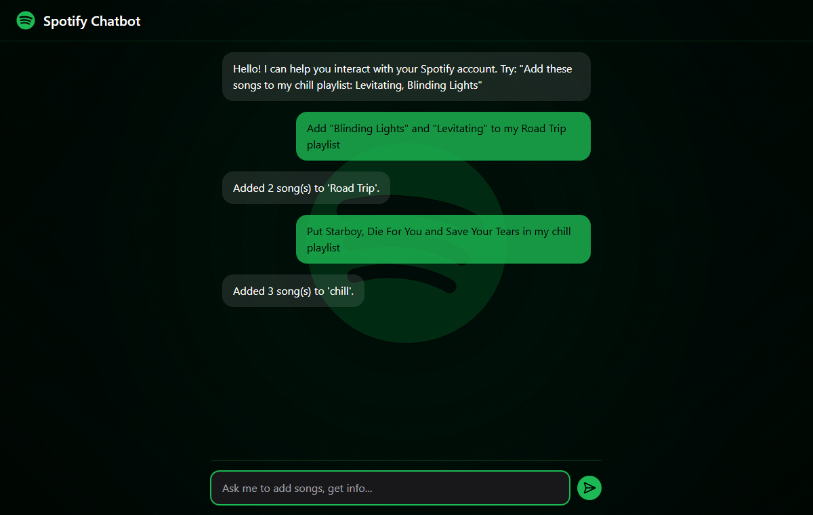

# Spotify Chatbot

Manage your Spotify playlists by chatting in plain English. Ask something like *"Add Blinding Lights and Levitating to my Road Trip playlist"*: an LLM works out what you want, and the backend finds the songs on Spotify and adds them to the playlist, creating it if it doesn't exist.



## How it works

```
React chat UI ──POST /chat──► FastAPI backend
                                  │
                                  ├─► Groq (Llama 3.1) ── message → JSON intent
                                  │     {"intent": "add_songs_to_playlist",
                                  │      "playlist_name": "Road Trip",
                                  │      "songs": ["Blinding Lights", "Levitating"]}
                                  │
                                  └─► Spotify Web API
                                        1. find the playlist by name (or create it)
                                        2. search each song, keep the best match
                                        3. add all tracks in one request
```

- **Intent extraction**: a few-shot prompt and Groq's JSON mode make the model return a strict JSON object, so the backend never parses free text. Requests it can't map to an action come back as `"intent": "unknown"`.
- **Spotify auth**: the backend uses the OAuth refresh-token flow. It exchanges the refresh token for an access token and refreshes it automatically before it expires.
- **Playlists**: matched by name, case-insensitively; missing ones are created as private playlists.

Currently supported: **adding songs to a playlist**.

## Tech stack

| Layer | Technologies |
|---|---|
| Frontend | React 19, Vite, Tailwind CSS, axios |
| Backend | Python, FastAPI |
| LLM | Groq API, Llama 3.1 8B Instant |
| Music | Spotify Web API (OAuth 2.0 refresh tokens) |

## Setup

### 1. Credentials

1. Create an app in the [Spotify Developer Dashboard](https://developer.spotify.com/dashboard) and add `http://127.0.0.1:8000/callback` as a redirect URI.
2. Get a free [Groq API key](https://console.groq.com/keys).
3. Copy `backend/.env.example` to `backend/.env` and fill in the Groq key, Spotify client ID and client secret.
4. Get a refresh token (one time):
   ```bash
   pip install -r backend/requirements.txt
   python backend/get_refresh_token.py          # prints an authorization URL
   python backend/get_refresh_token.py <code>   # with the code from the redirect URL
   ```
   Put the returned `refresh_token` in `backend/.env` as `SPOTIFY_REFRESH_TOKEN`.

### 2. Run

From the repository root:

```bash
uvicorn backend.main:app --reload
```

In another terminal:

```bash
cd frontend
npm install
npm run dev
```

Open http://localhost:5173. The frontend calls `http://localhost:8000` by default; set `VITE_API_URL` to change it.

## Project structure

```
├── backend/
│   ├── main.py               # FastAPI app, /chat endpoint
│   ├── llm_handler.py        # Prompt, Groq call, intent → Spotify actions
│   ├── spotify_api.py        # Token refresh, search, playlists, adding tracks
│   └── get_refresh_token.py  # One-time OAuth helper
├── frontend/                 # React chat interface
└── experiments/
    └── rag-code-generator/   # Unfinished RAG experiment (see its README)
```

## Experiment: RAG code generator

[`experiments/rag-code-generator`](experiments/rag-code-generator) is a separate, unfinished attempt at a more general assistant: scrape the Spotify Web API reference, store it in a vector database, and have an LLM write Python code for any request using the retrieved documentation.

## License

[MIT](LICENSE)
